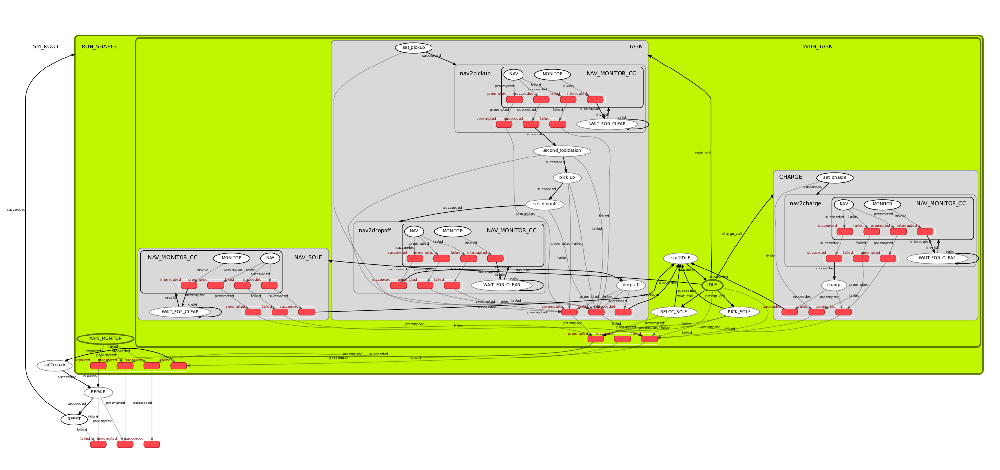

# FORKLIFT_FSM

## Description

* 这是一个无人叉车的状态机，用于控制无人叉车的行为。
  * 使用rosservice调用切换状态，从参数服务器中读取或者设置状态机的参数。
  * 然后执行状态机，使用actionlib实现状态机的行为。
  * 可以使用smach_viewer可视化状态机的结构。
    *   

## 目录

* 该项目的目录结构:
  * action: 无人叉车的行为定义
    * 10.15:只实现了PurePursuit的action
  * doc： 该状态机的文档
  * launch: 该状态机的启动文件
    * `test.launch`: 该状态机的测试启动文件
    * `main.launch`: 该状态机的主启动文件
  * scripts: 该状态机的实现代码
    * `ActionServer.py`: 该状态机的actionlib服务器
    * `APIService.py`: 该状态机的service服务器
    * `SubStateMachine.py`: 该状态机的底层子状态机
    * `main.py`: 该状态机的主程序入口
  * test: 该状态机的测试代码
    * `API_Client.py`: 该状态机的API类模块，用于调用状态机
    * `TestAPICall.py`: 测试用示例文件，通过读取键盘值，调用`API_Client.py`的API接口调用状态机
    * `TestActionServer.py`: 构建了一个模拟action服务器，用于测试状态机的动作状态

## 环境依赖
### 基础依赖
* 该项目依赖于以下环境
  * ROS Melodic
  * Python 2.7
  * Ubuntu 18.04

* 若要在`Ubuntu 20.04`上实现
* 需改变python文件开头的声明的python版本
```python
#!/usr/bin/env python3
```

### ros包依赖
* 该项目依赖于以下ROS包
  * [actionlib](http://wiki.ros.org/actionlib)
  * [smach](http://wiki.ros.org/smach)
  * [smach_ros](http://wiki.ros.org/smach_ros)


### 测试用软件依赖
* [readchar](https://pypi.org/project/readchar/)
  * 通过命令行下面安装
```shell
pip install readchar
```
* 在ubuntu20.04上
```shell
pip3 install readchar
```

## 安装
* 确保已经安装了ROS Melodic
* 安装smach
```shell
sudo apt-get install ros-melodic-executive-smach
```
* 创建工作空间
```shell
mkdir -p ~/catkin_ws/src
cd ~/catkin_ws/src
```
* git下载代码
```shell
git clone https://github.com/2B-people/ForkliftFSM.git
```
* 编译
```shell
cd ..
catkin_make
```
* 加载环境
```shell
source devel/setup.bash
```


## 状态机构建

* 该项目使用[smach](http://wiki.ros.org/smach)构建状态机，存在3层次的状态机
  * 顶层状态机：负责调用底层状态机，实现状态机的切换
  * 底层状态机：负责实现状态机的行为
  * 动作状态机：负责实现动作的细节
  * 构建思路见xmind文档

## 测试调用状态机

* 见文档：[TestAPI_Example.md](doc/TestAPI_Example.md)


## 可查找参数

* 该状态机的参数都存储在参数服务器中，可以通过`rosparam list`查看
* 该状态机的参数都存储在`/fsm_node`命名空间下，可以通过`rosparam list /fsm_node`查看
* fsm的状态有三层，通过`CallFSM.get_active_state()`方法可以获得当前状态
  * 示例，可以读到：`['RUN_SHAPES', 'TASK', 'nav2pickup']`
